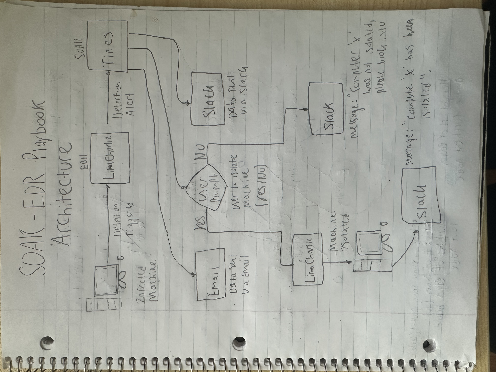

# SOAR-EDR

### What is SOC? 

A SOC (Security Operations Center) team serves as a centralized location for monitoring and defending against threats. Some functions include monitoring the environment using a SIEM, isolating/shutting down infected endpoints and removing malware. They often need a constant flow of threat intelligence to ensure they have constant flow of data such as IP addresses, domains, hashes, and other indicators. 

SOCs face many challenges such as alert fatigue (false positives) and security tools being deployed without integration in an organization. As well as, when SOCs handle security incidents, there are <b>no written step-by-step instructions</b> for how to investigate alerts. This becomes a problem when new analysts come and try to solve problems but do not know where to begin. 

### What is SOAR? 

SOAR stands for Security Orchestration Automation and Response which is a tool that unifies all the security tools used in a SOC (Security Operations Center). 

1. <b>Security:</b> This refers to everything that helps protect a system, network, user, and data from attacks. For instance, it can be logs from a SIEM, firewalls, IDS/IPS. As well are Threat Intelligence, and alerts such as brute-force attempts. 

2. <b>Orchestration:</b> Normally a SOC analyst would have to manually switch between tools such as a SIEM, IAM, ticketing systems and more. This function helps connect tools, pass data between them, and execute a playbook. 

3. <b>Automation:</b> Once all the tools are coordinated through a playbook (predefined list of actions) seen in Orchestration, that playbook, can be automated. This saves a ton of time for a SOC analyst as they do not have to manually click as much anymore. 

4. <b>Response:</b> This is the remediation & containment portion of the playbook, which may occur at any given time where it can also be automated. 

### What is LimaCharlie? 

It is a an Endpoint Detection and Response (EDR) solution that helps customers have real-time visibility by streaming telemetry data. It also uses a YAML (Yet Another Markup Language) which is a human-readable serialization language used for configuration files and applications where data is stored or transmitted. This allows security teams to make highly sophisticated detections and the ability to track detection login. 

### What is Tines? 

This is a SOAR tool that lets IT and Security teams build automation workflows also called "Stories" with no code/low code drag and drop actions. It integrates with many tools, and in this case, it will integrate with the EDR, LimaCharlie. 

### Architecture

### Endpoint Agent Installation 

Head over to <a href="https://docs.limacharlie.io/docs/endpoint-agent-installation"> Lima Charlie Endpoint Agent Documentation</a> and the follow the provided steps to install the agent. 

Go to <b>Sensors</b> and you should be able to see your endpoint installed. This agent is important to produce and transmit telemetry on the endpoint (the machine itself).  