# SOAR-EDR

### What is SOC? 

A SOC (Security Operations Center) team serves as a centralized location for monitoring and defending against threats. Some functions include monitoring the environment using a SIEM, isolating/shutting down infected endpoints and removing malware. They often need a constant flow of threat intelligence to ensure they have constant flow of data such as IP addresses, domains, hashes, and other indicators. 

SOCs face many challenges such as alert fatigue (false positives) and security tools being deployed without integration in an organization. As well as, when SOCs handle security incidents, there are <b>no written step-by-step instructions</b> for how to investigate alerts. This becomes a problem when new analysts come and try to solve problems but do not know where to begin. 
<

### What is SOAR? 

SOAR stands for Security Orchestration Automation and Response which is a tool that unifies all the security tools used in a SOC (Security Operations Center). 

1. <b>Security:</b> This refers to everything that helps protect a system, network, user, and data from attacks. For instance, it can be logs from a SIEM, firewalls, IDS/IPS. As well are Threat Intelligence, and alerts such as brute-force attempts. 

2. <b>Orchestration:</b> Normally a SOC analyst would have to manually switch between tools such as a SIEM, IAM, ticketing systems and more. This function helps connect tools, pass data between them, and execute a playbook. 

3. <b>Automation:</b> Once all the tools are coordinated through a playbook (predefined list of actions) seen in Orchestration, that playbook, can be automated. This saves a ton of time for a SOC analyst as they do not have to manually click as much anymore. 

4. <b>Response:</b> This is the remediation & containment portion of the playbook, which may occur at any given time where it can also be automated. 


### What is LimaCharlie? 

It is a an Endpoint Detection and Response (EDR) solution that helps customers have real-time visibility by streaming telemetry data. It also uses a YAML (Yet Another Markup Language) which is a human-readable serialization language used for configuration files and applications where data is stored or transmitted. This allows security teams to make highly sophisticated detections and the ability to track detection login. 


### What is Tines? 

This is a SOAR tool that lets IT and Security teams build automation workflows also called "Stories" with no code/low code drag and drop actions. It integrates with many tools, and in this case, it will integrate with the EDR, LimaCharlie. 


### Architecture

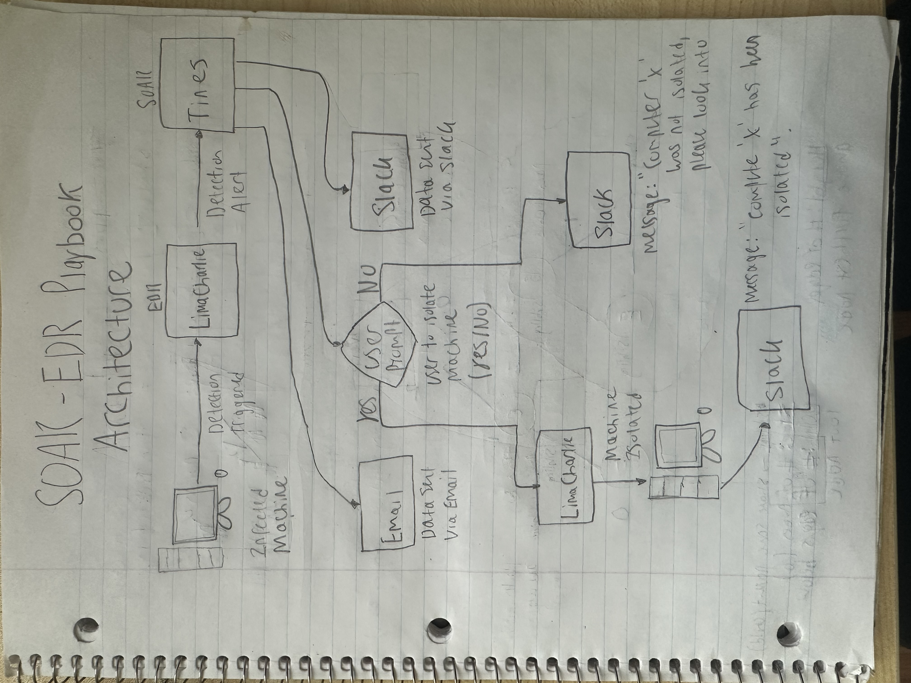
<hr>

## How to set up LimaCharlie

Before anything, please go to <a href="https://limacharlie.io/"> LimaCharlie's website</a> and sign up either through a username and password or via an Identity Provider (IP), such as Google. 

### Endpoint Agent Installation 

Once you have signed up, Head over to <a href="https://docs.limacharlie.io/docs/endpoint-agent-installation"> Lima Charlie Endpoint Agent Documentation</a> and the follow the provided steps to install the endpoint agent. This agent is important to produce and transmit telemetry on the endpoint (the machine itself). 

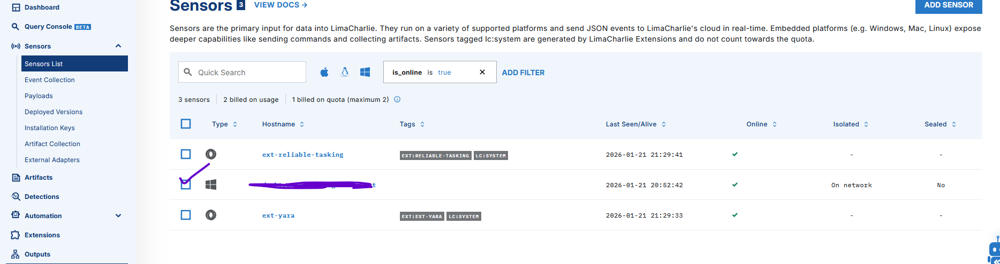

Go to `Sensors` and you should be able to see your endpoint installed. 
<hr>

### Simulate Attack 

on your Windows computer, go to `Settings`, `Privacy & Security`, then to `Windows Security`. If you have a different antivirus software installed such as <b>Avast</b>, click on `Open App`, then disable `File Shield`. Disable a setting that monitors malicious files. This will let us run a program called <b>LaZagne.exe</b>. 

If not, click on `Virus & threat protection` --> `Manage Settings`. You want to turn off `real-time protection`. You can follow this video --> <a href="https://www.youtube.com/watch?v=TjqzYG_01do"> Disable real-time protection</a> to help navigate this step. 

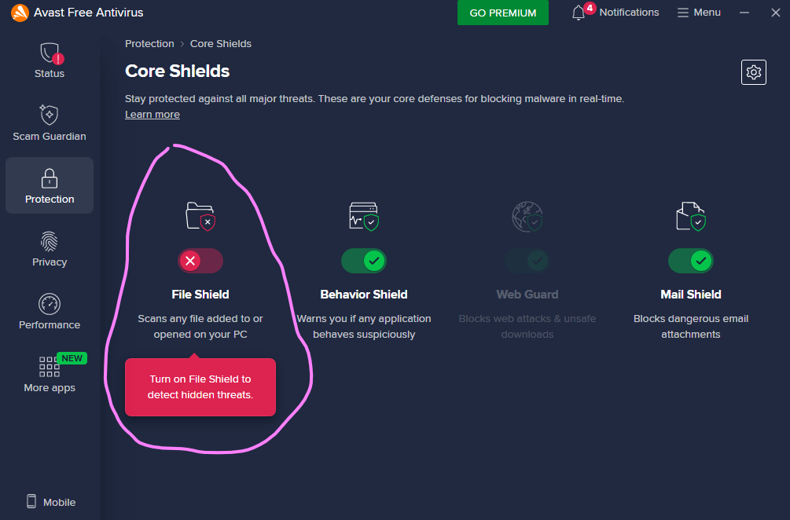

Now head over to <a href="https://github.com/AlessandroZ/LaZagne/releases/tag/v2.4.7"> LaZagne</a> and download the <b>LaZagne.exe</b> file. This is a program that lets you retrieve lost passwords on your local computer. ❌ Please do not use this to perform intended malicious actions ❌, only controlled attacks for learning purposes.  

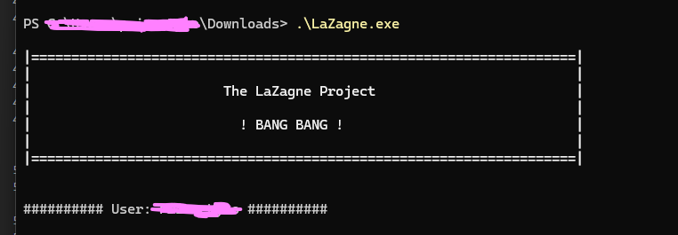


Open <b>Powershell</b>, and head over the directory that holds the file. You can use the `cd` command to do so. You want to run this file by entering `.\LaZagne.exe`. The file will present <b>! BIG BANG !</b> and below it, you will see all the passwords stored locally either in plaintext or as a hash. 

The agent on the endpoint will pick this up in `TimeLine` hopefully. 

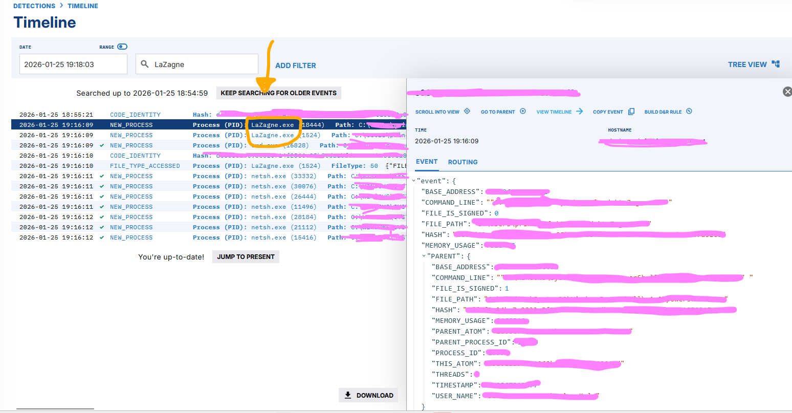

Perfect! the <b>endpoint agent</b> was able to pick up this process running on the local computer. If we click on it, we can see all the <b>event details</b>. These details will be important for making the detection rule. 
<hr>

### Develop Detection 

In your organization, click on `Automation`, then `D&R Rules`, hit `ADD RULE` at the top right. There are two sections labeled <b>Detect</b> and <b>Response</b>. This is where we are going to write our detection rules. 

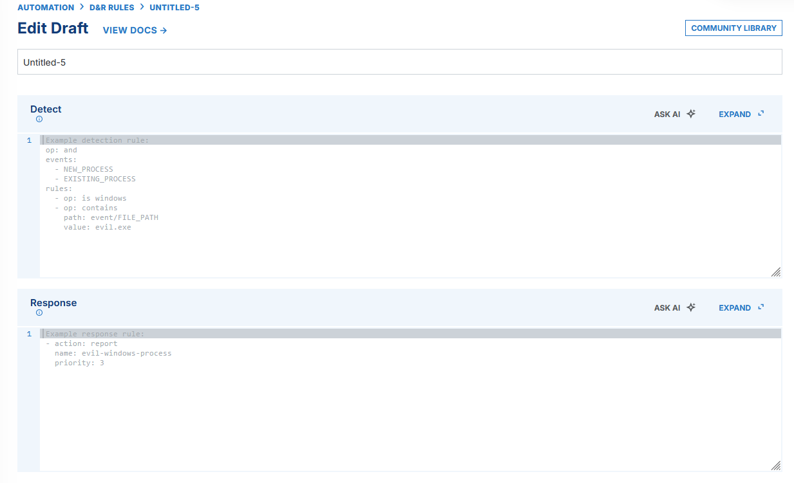

<b>Detect:</b> In this section, copy the following text: 

        ```
    events:
    - NEW_PROCESS
    - EXISTING_PROCESS
    op: and
    rules:
    - op: is windows
    - op: or
    rules:
      - case sensitive: false
        op: ends with
        path: event/FILE_PATH
        value: LaZagne.exe
      - case sensitive: false
        op: contains
        path: event/COMMAND_LINE
        value: LaZagne
        ```

<b>Respond:</b> In this section, copy the following text: 

    ```
    - action: report
    metadata:
    author: rl-DFIR
    description: SOAR-EDR Tool (Detects Lazagne.exe execution)
    falsepositives:
      - Damn it MANN
    level: high
    tags:
      - attack.credential_access
    name: rl- DFIR - Lazagne (SOAR-EDR)
    ```
<hr>

Once the information is filled, name the detection `LaZagne.exe Detection`, then click `Create`. We now have a fully functioning detection. In practice, before deploying detections in a production environment, it is important to test it in a testing environment. This is important as it will help identify if any changes need to be made to the detection logic. 

In this case, go back to `Sensors`, your sensor, `Timeline`, find the LaZagne.exe event, click on it, then click on `COPY EVENT`. After copied, go back to `D&R Rules`, scroll down and you will see `TARGET EVENT`. 

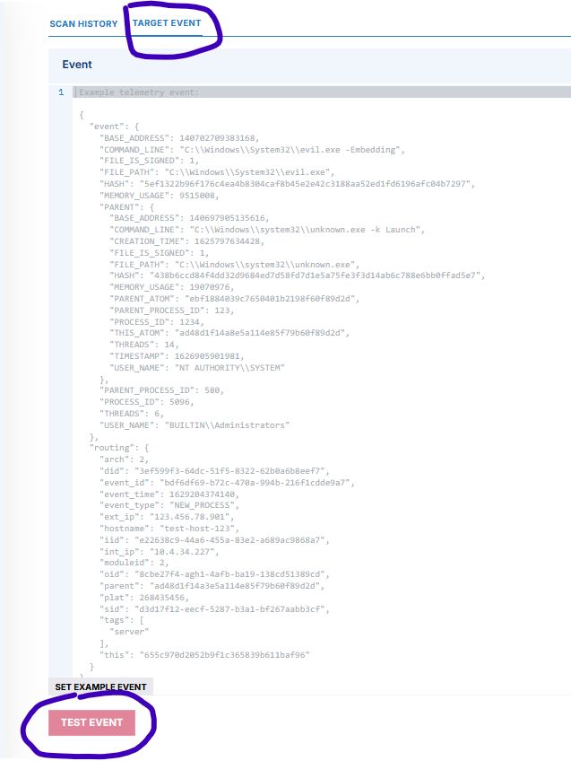

Paste the copied event there, then hit `TEST EVENT`. If the detection logic is valid, it should display Match at the bottom. 

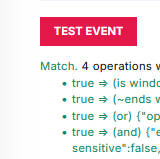
<hr>

### Simulate Attack Again 

Once the detection is made, simulate the attack again and see if LimaCharlie (EDR) will pick it up. 


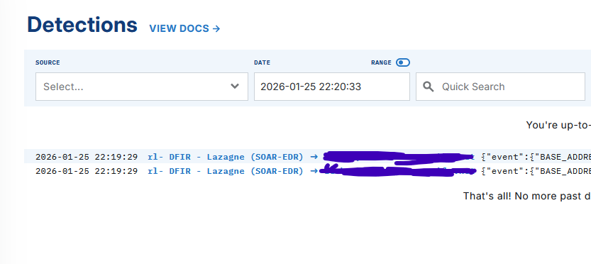

Success! An event showed up in `Detections` and it corresponds to the detection rule that was made. 
<hr>

## Tines and LimaCharlie (Integration)

Go to <a href="https://slack.com/"> Slack.com</a> to setup a new account, and then go ahead and create a `new workspace`. It can be named anything, as long as you know that it is specific to this project. Create a new channel called `alerts`. 


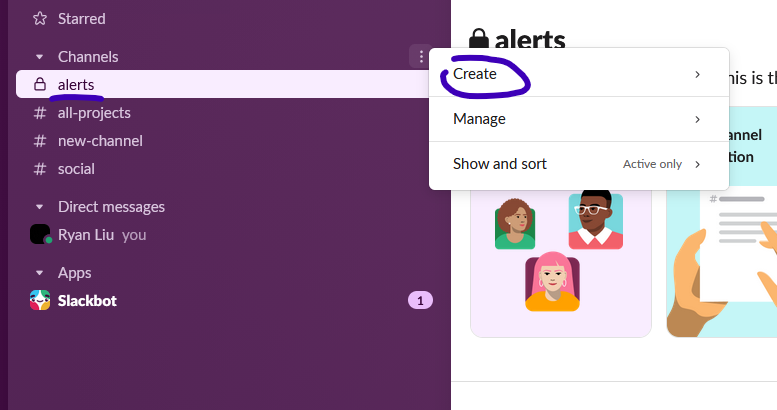

Go to <a href= "https://www.tines.com/">Tines.com</a> and set up a new account. This is where the playbook/story will be created. 

Once LimaCharlie produces a detection, Tines will send a message that contains the provided details to the alerts channel. 

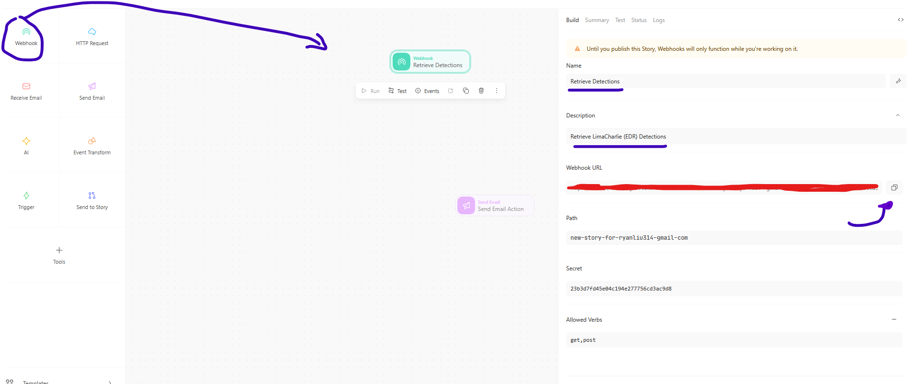

Now in your story, drag `WebHook` to the right. This will allows Tines to receive data instantly when events occur in another system. In this case, it will receive detections from LimaCharlie (EDR). Now copy the `webhook URL`. 

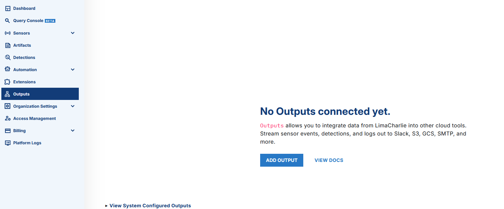

Go back to LimaCharlie, and in your organization, click on `Outputs`, then `ADD OUTPUT`. 

There will be 4 steps that will be required. First, click on `Detections`, `Tines`. Name it `SOAR-EDR`, then the `DESTINATION HOST` will be the <b>webhook URL</b>. 

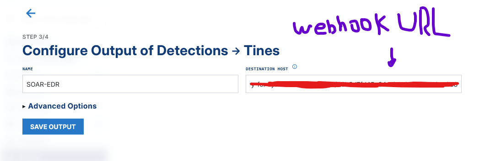

Now, click `SAVE OUTPUT`, lastly, click `ALL DONE`. 

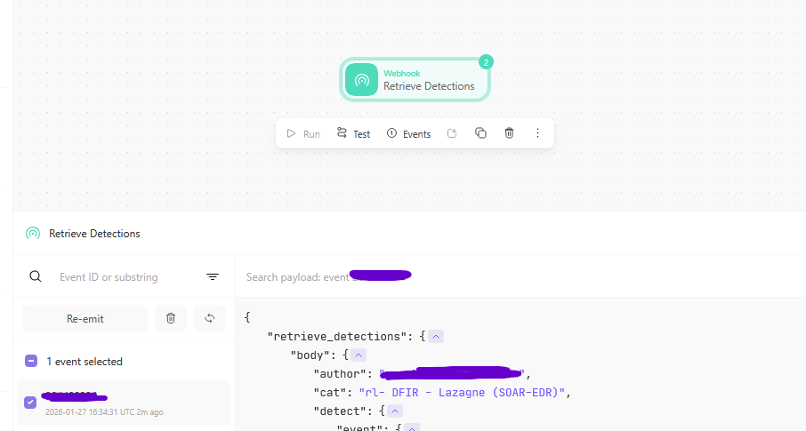

To double check if they are connected, simulate the attack once again, then go to `Events` on the Webhook. If an event occurred, they are connected!
<hr>

## Linking Tines and Slack

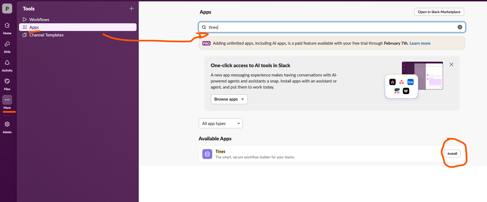

Go to Slack, click on `More`, `Apps`, in the text bar, search up Tines, and then click `Install`. You will be taken to a website that will help you install the <b>credential</b> needed to link both platforms. Once done, we can move onto the next step. 

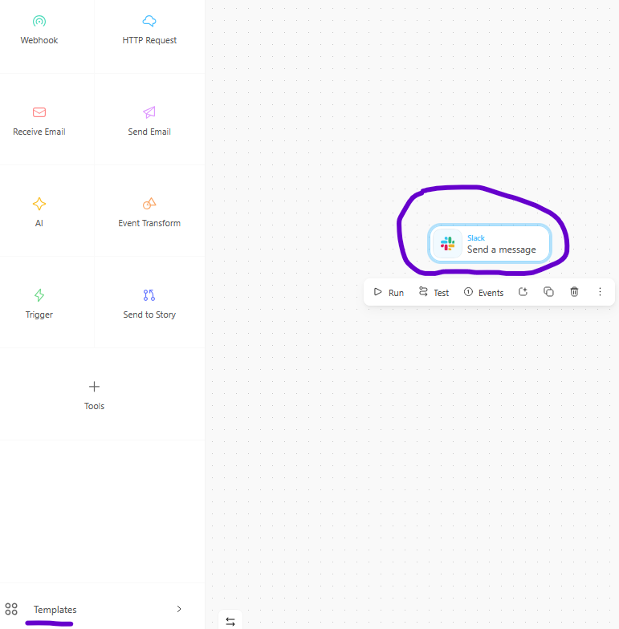

In tines, click on `Templates`, search up `Slack`, then click on `Second a message`. 

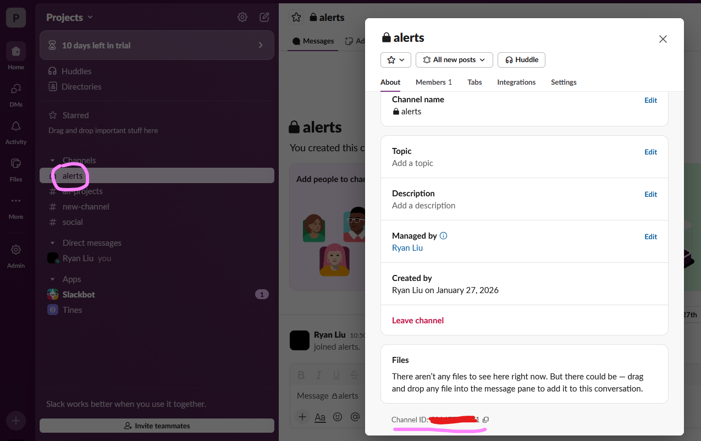

Go to Slack, choose the `alerts` channel that we created, hit `view channel details`, then copy the `Channel ID`. 

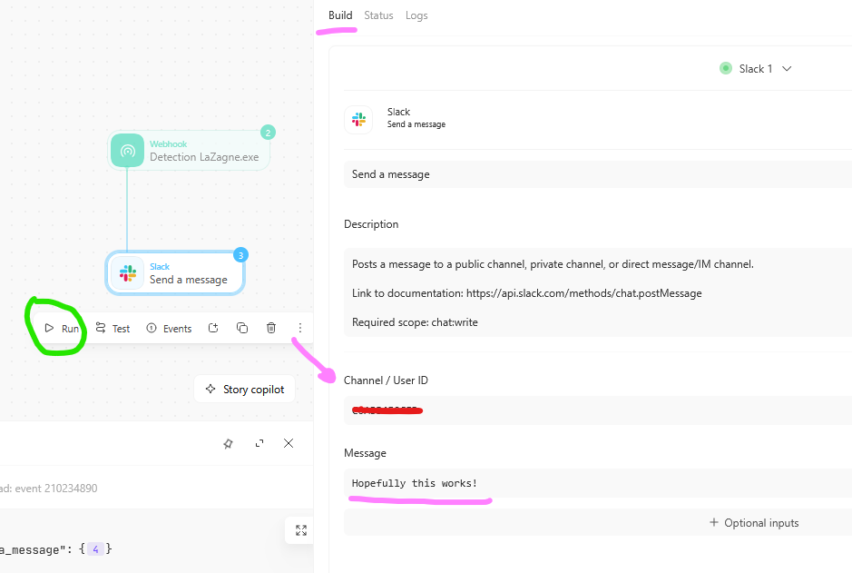

Click on Slack, go to `Build`, and paste the channel ID. After, click on run to make sure that they are linked. 

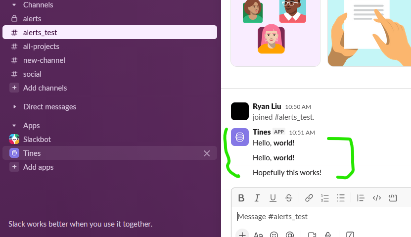

In the channel, you should see a message from Tines appear! 
<hr>

## Setting up Email connection 

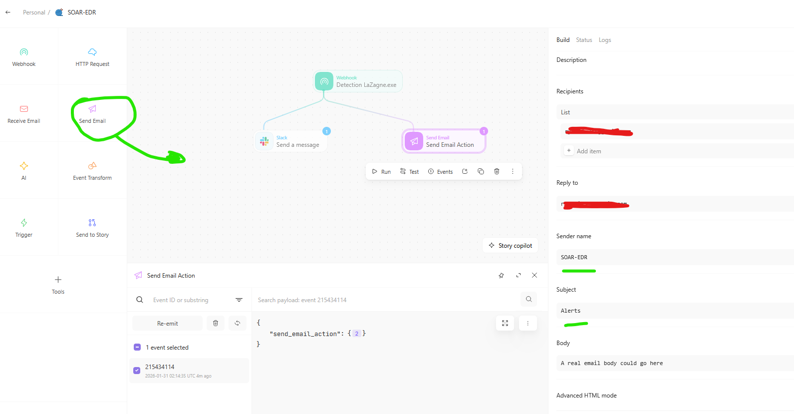

Perform the same process. Drag the email icon to the left. Within it, click on `Build` and put anything. We will change what goes into it later. Use a personal email or new email to test if the integration works. 
<hr>

## User Prompt Setup


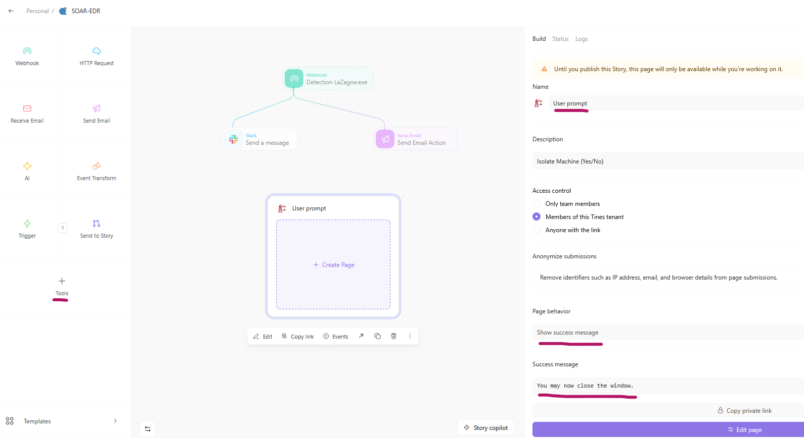

CLick on `Tools`, then `Page`. Name the page `User Prompt`, and in the description this is where the user can either isolate the machine or not. You can write `Isolate Machine (Yes/No)`. For the success message, you can put anything such as `You may now close the window.`

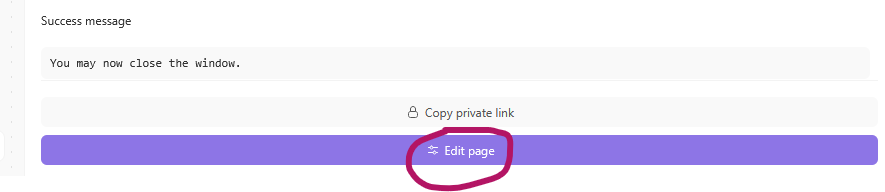

Click on `Edit page`. 

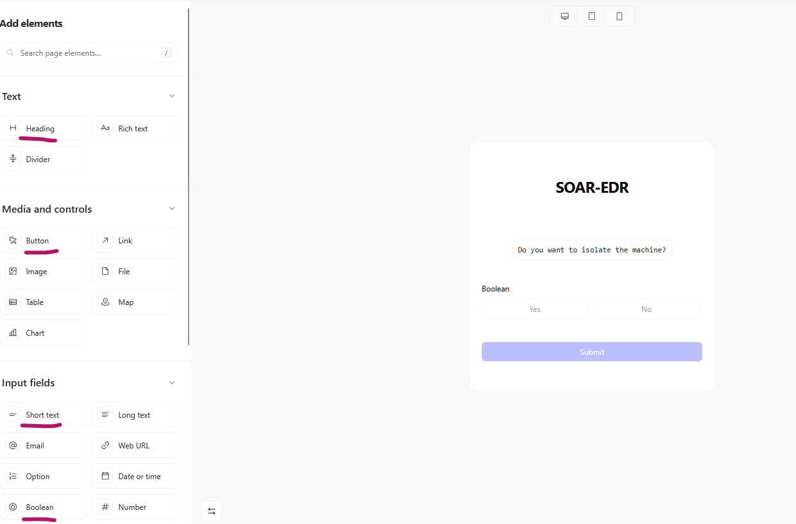

Play around with the page, doesn't have to be perfect. This page is what the user will see whether to isolate the machine or not. We will add the details mentioned in the playbook earlier, later on. 

```
Title: <<detection_lazagne_exe.body.cat>>
Time (Epoch Format): <<detection_lazagne_exe.body.detect.routing.event_time>>
Hostname: <<detection_lazagne_exe.body.detect.routing.hostname>>
IP Address: <<detection_lazagne_exe.body.routing.int_ip>>
Username: <<detection_lazagne_exe.body.detect.event.USER_NAME>>
File Path: <<detection_lazagne_exe.body.detect.event.FILE_PATH>>
Command Line: <<detection_lazagne_exe.body.detect.event.COMMAND_LINE>>
Sensor ID: <<detection_lazagne_exe.body.detect.routing.sid>>
Event ID: <<detection_lazagne_exe.body.detect.routing.event_id>>
Link: <<detection_lazagne_exe.body.link>>
```

These are the paths that include all the details that a user will see on the page. You can go back to `detections` on LimaCharlie, then look at the event details. There are many to choose from, but make sure to `Copy path` and not `Copy value`. If not, you can simply copy all the paths above. 

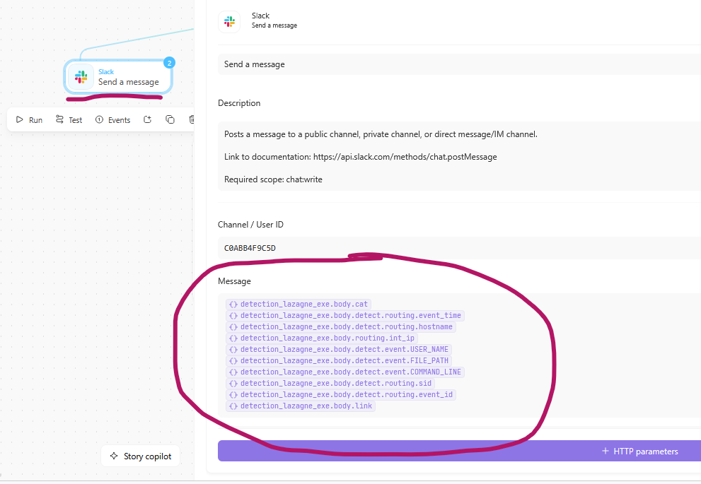

Once copied, click on `Slack` in Tines, then in the `Message`, simply paste all the content. 

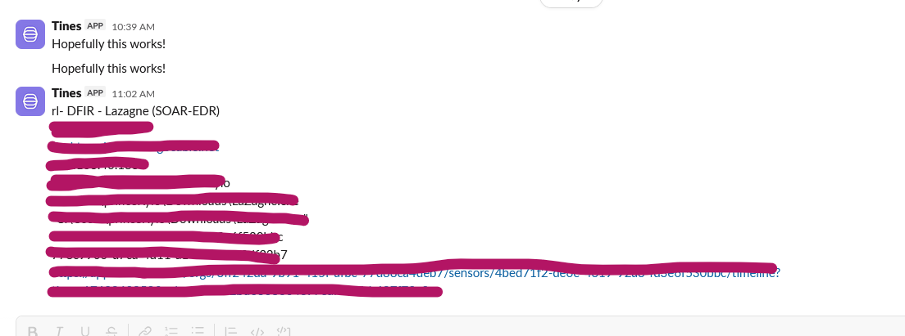

Click on `Test`. Go back to `Slack` and see if the content appears in the `alerts` channel. If it does, it is working! 

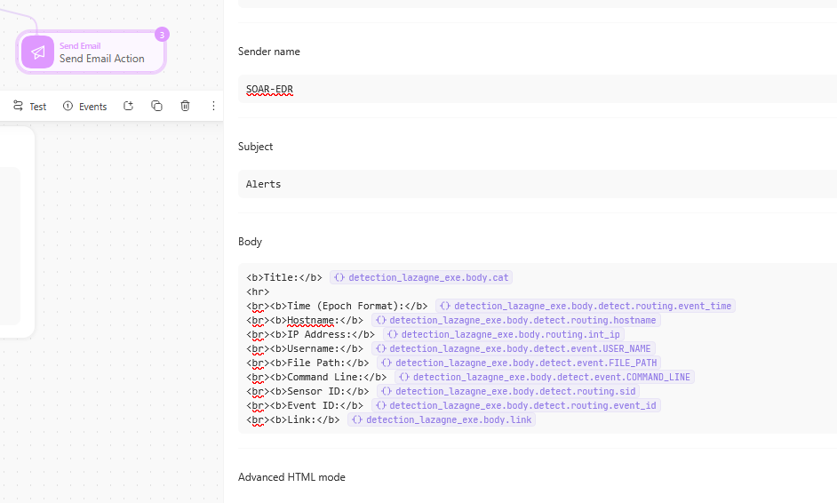

  ```HTML
    <b>Title:</b> <<detection_lazagne_exe.body.cat>>
    <hr>
    <br><b>Time (Epoch Format):</b> <<detection_lazagne_exe.body.detect.routing.event_time>>
    <br><b>Hostname:</b> <<detection_lazagne_exe.body.detect.routing.hostname>>
    <br><b>IP Address:</b> <<detection_lazagne_exe.body.routing.int_ip>>
    <br><b>Username:</b> <<detection_lazagne_exe.body.detect.event.USER_NAME>>
    <br><b>File Path:</b> <<detection_lazagne_exe.body.detect.event.FILE_PATH>>
    <br><b>Command Line:</b> <<detection_lazagne_exe.body.detect.event.COMMAND_LINE>>
    <br><b>Sensor ID:</b> <<detection_lazagne_exe.body.detect.routing.sid>>
    <br><b>Event ID:</b> <<detection_lazagne_exe.body.detect.routing.event_id>>
    <br><b>Link:</b>
    <a href="<<detection_lazagne_exe.body.link>>">Detection Link</a>
  ```

Now, to do this for email, we do the same exact same process. However, here, i did some HTML to make it clearer in the email. You can simply copy and paste the HTML code above and paste it in `Body` text box. 

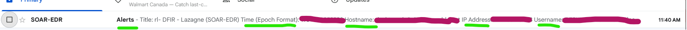

If it worked, you should receive an email that looks just like this. Now, lets continue building out the User prompt.

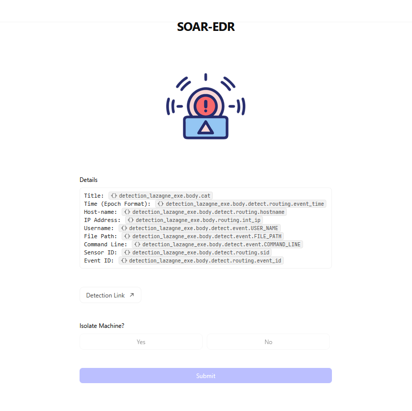

Do the same actions, copy and paste the important content into a text box. You can do this by going into `Input fields`, then `Long text`. I also included an image and a separate detection link for organization and clarity. As the user, once you click `No`, we should also be able to send a message to Slack. Let's take a look. 

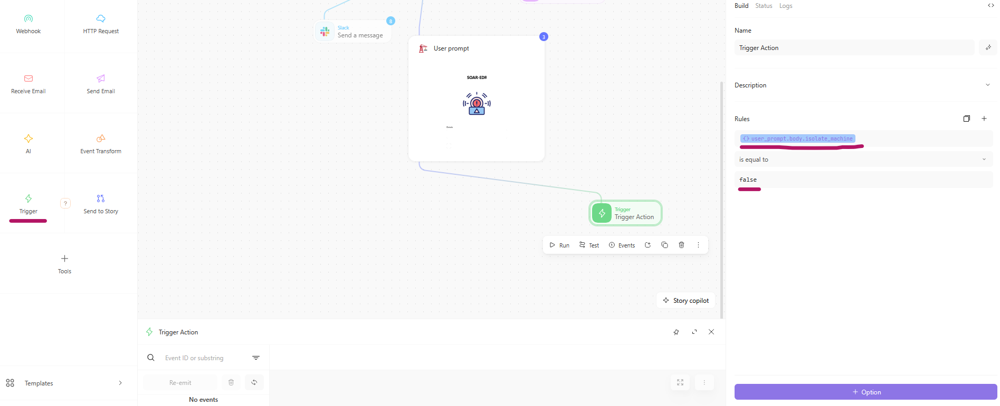

To do this, click on `Trigger`, then in the rules, click on `user_prompt`, `body`, and then `isolate machine`. Set it equal to `false`. 

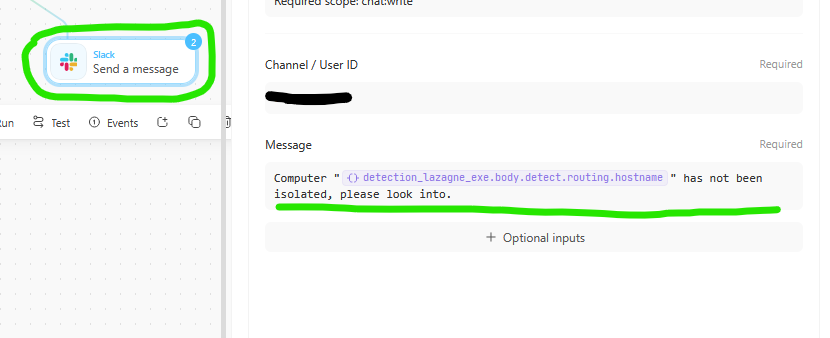

To connect with Slack, drag the `Slack` icon. Input the same or different `Channel ID`. Then in the Message, we need the path to the hostname. Simply copy and paste this into that field: `Computer <<detection_lazagne_exe.body.detect.routing.hostname>> please look into.`

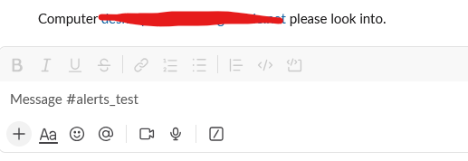

Re-run the event. You should see the message appear in Slack! Now that we have completed this portion, we will work on the part when the user clicks "Yes" to isolate the machine. 

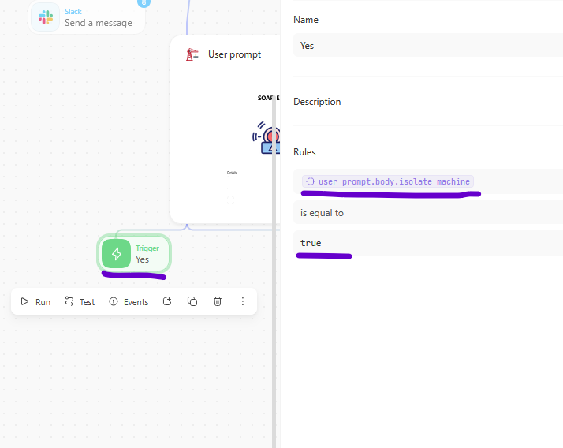

 Perform the same operation. The only field changing is `false --> true` and the name set to `yes`. 


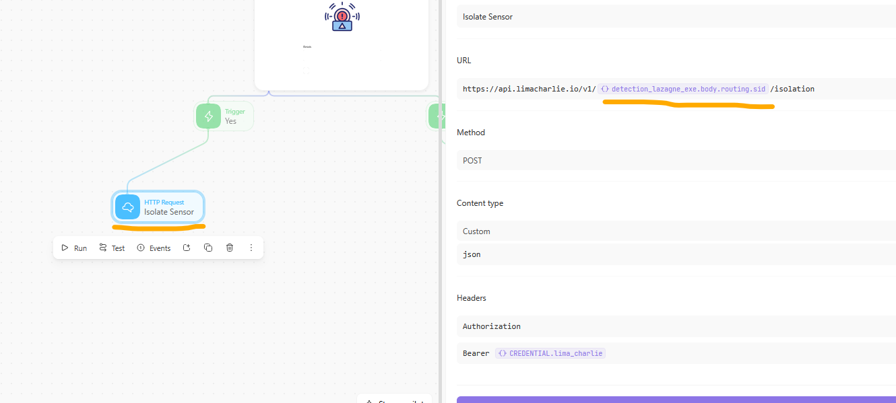

In order to isolate the machine, we need to tell LimaCharlie to do so. Go to `templates`, search `LimaCharlie`, then select `Isolate Sensor`. Now in the URL field, we can paste `<<detection_lazagne_exe.body.detect.routing.sid>>` or we can go through the tines workflow and use `{} detection_lazagne_exe.body.routing.sid`. 

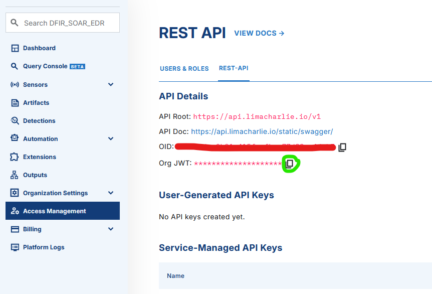

Now we need a credential in order to connect platforms. Go to LimaCharlie, then go down to `Access Management` then to `REST-API`.
click on the copy icon next to `Org JWT`

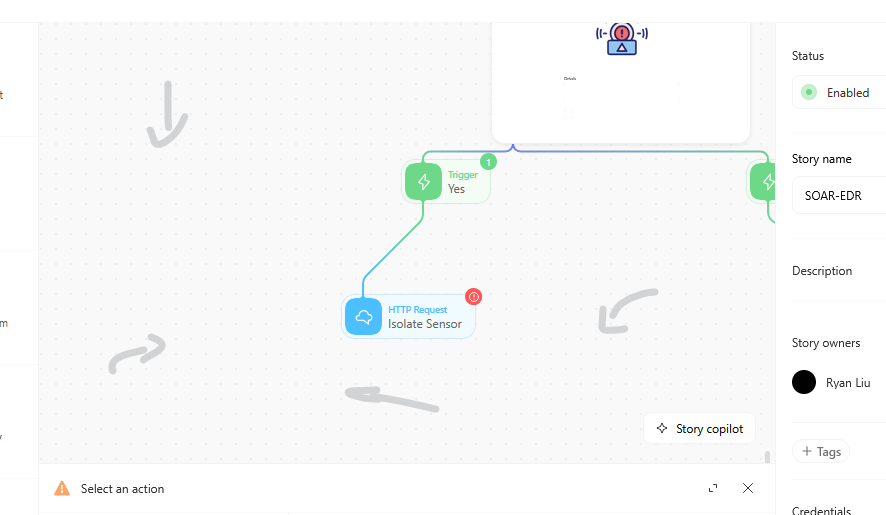
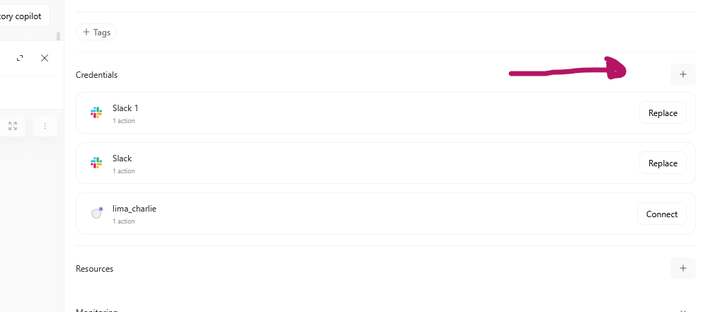
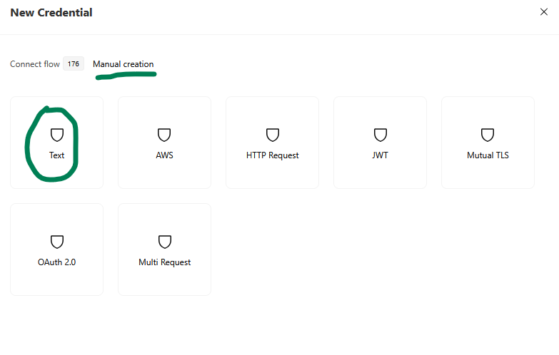
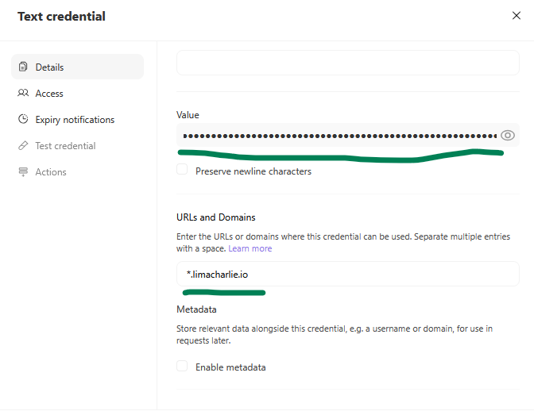

Click in the empty space. Click the `+` icon, then head to `Manual creation`, then to `Text`, then at the bottom right there should be a `Create credential`, select that. You can name and describe the credential anything you wish. Paste the `Org JWT` we copied into the `Value` field. After, type in `*.limacharlie.io` into `URLs and Domains`. This makes sure the credential is only used to that site and its subdomains.  

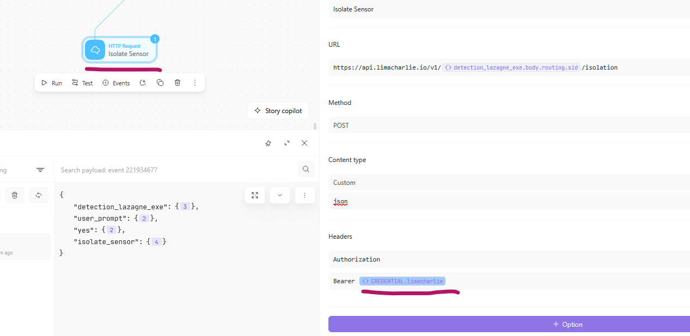

Click on `Isolate Sensor`, and in the `Headers field`, type in `{}CREDENTIAL_limacharlie`. NOTE, only do so if you named the credential <b>limacharlie</b>. 

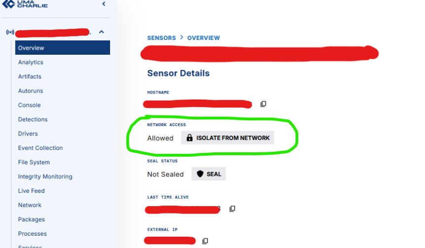

Return to LimaCharlie, click on the sensor, and we should see that the sensor currently has network access. Now lets re-emit the event, click "Yes" to isolate and see what happens! <b>NOTE: YOU WILL BE DISCONNECTED FROM THE INTERNET IF NOT USING A VIRTUAL MACHINE</b>. You can still do this, but make sure to have another device where you can log on into LimaCharlie. 

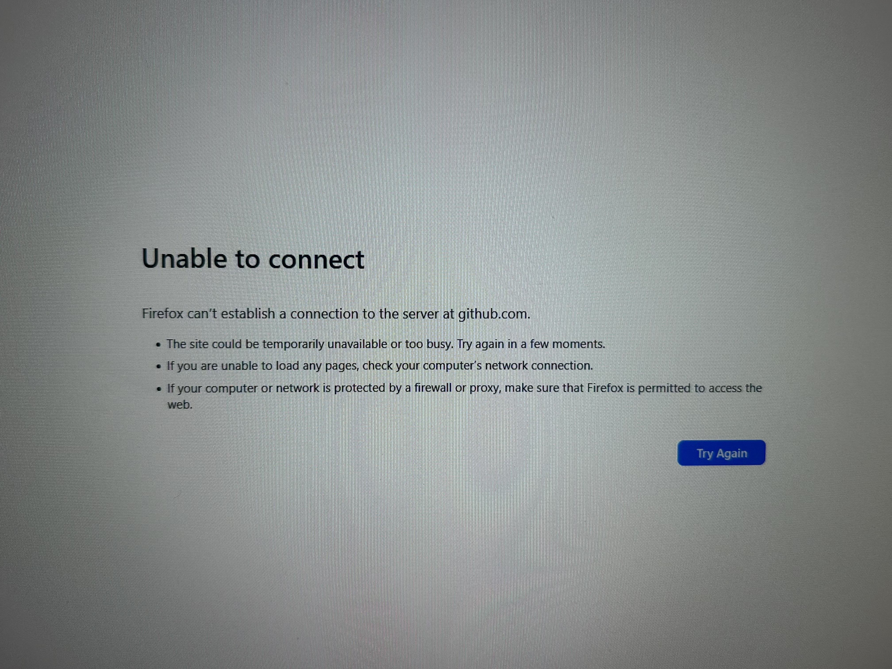

Wow! Look at that, my computer completely disconnected from the internet. I will log into LimaCharlie onto my MacBook and see happens. 


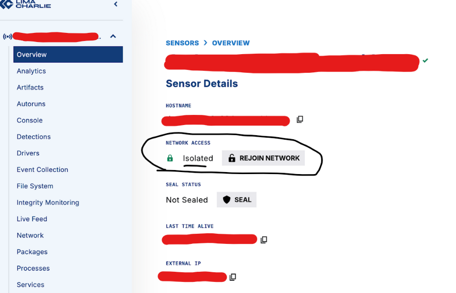

We can see that the sensor is now isolated from the network. If an attacker were to gain access to that sensor, isolating it from the network reduces the chance they can traverse the network. To connect the sensor back to the network, simply click on `Rejoin Network`. The last thing to do, is send a message to Slack that the computer is isolated. I want you to try and do this. 

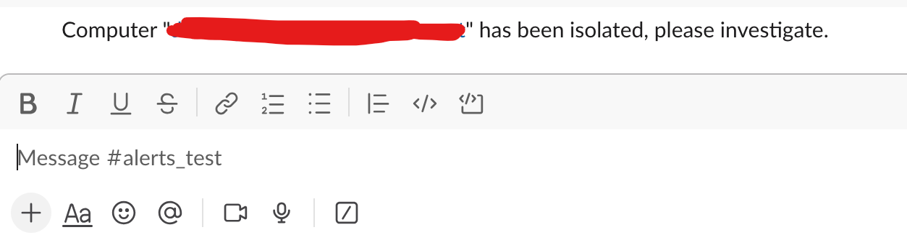

If you did it correctly, you should have receive a message similar to this. 
<hr>

## Conclusion

Thank you for following along with this project. I hope you had fun and learnt a bit about how we can orchestrate an EDR with a SOAR platform! 


