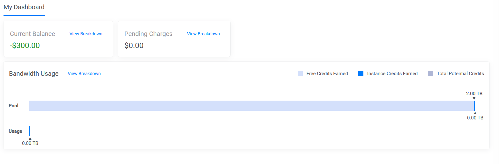
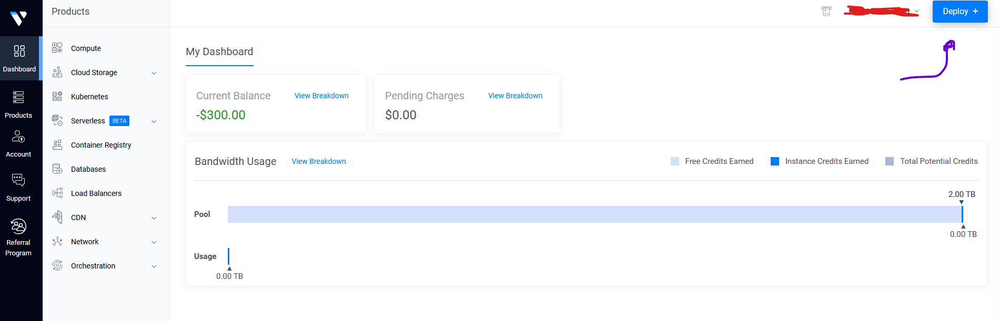
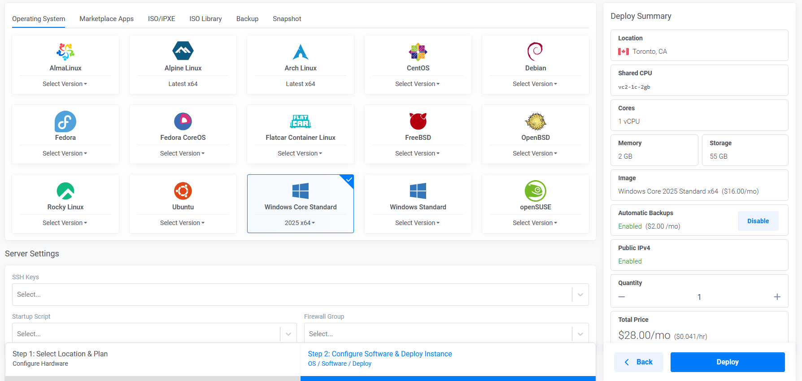
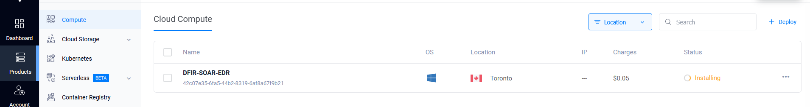

### What it Vultr? 

It is a cloud infrastructure provider that lets you run servers, storage and networking without needing to own the infrastructure yourself. It's main function is to spin up virtual servers and services. It is not as big as Azure, AWS, Or GCP which provide many more services that can be integrated within an organization. 

Go to <a href="https://www.vultr.com/coupons/"> Vultr Coupon</a> and copy the coupon code. This will let you run your virtual machine until that credit amount is used up. 

Now go to → <a href="https://www.vultr.com/register/"> Vultr Registration</a> and sign in via Google, Github, or click on `Create free account`. Note, these vouchers change overtime. 

It will now ask for your credit card information. Don't worry, as long as we don't go over the credit limit of `$300`, it will not charge you. Once you complete this step, you should click on `Dashboard` where it will show your current balance. 

On the top right, click on `Deploy`, then `Deploy New Server`. 

Now you can play around making your Virtual Machine, make sure to choose `shared CPU` as we do not need the other options for this use case. I chose to use `Windows Core Standard 2025 x64` as the OS. Name the server hostname, in this case, I chose `DFIR-SOAR-EDR`. Lastly, click on `Deploy` in the bottom right. 

Go to `Products`, and you should see the installation in progress. It will take some time, but you have just set up a VM for this project! 